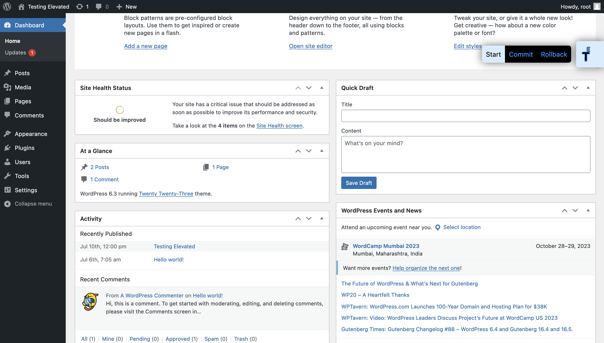

 

# Testing Elevated
This plugin helps to test the WordPress plugin or theme. It creates a kind of virtual environment for testing. You can do all things without affecting the site's actual database, but still, things work as they should be. After that, you can revert the changes or apply the changes to the actual database. 

It helps when you want to test something on the actual database but not sure about the results. It is very helpful for testing or developing the plugin or theme.

## Features
- Revert or flush the changes you made during testing.
- Apply those changes to the actual database and make it persistent.

## How to use

1. Install and activate the plugin.
2. Select the *Start* option from the sidebar.
3. Do your testing.
4. Select the *Rollback* option from the sidebar to revert the changes.
5. Select the *Commit* option from the sidebar to apply the changes to the actual database.

## Screenshots

 

## Want to contribute?

1. [Fork the repository](https://github.com/Utsav-Ladani/Testing-Elevated).
2. Clone the repository.
3. Create a new branch.
4. Make changes.
5. Commit and push the changes.
6. Create a pull request.
7. Wait for the review.
8. If everything is fine, your pull request will be merged.

## Changelog

### v1.0.0
- First release :)

## Upgrade Notice

### v1.0.0
- First release :)

## Author
**Name**: Utsav Ladani

